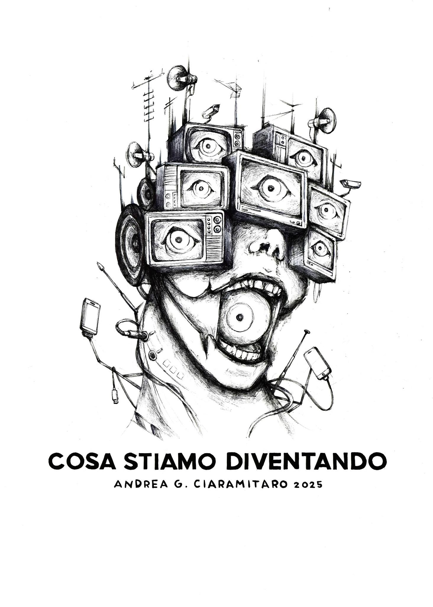

# Cosa Stiamo Diventando, Viareggio's 2025 Carnival




## Arduino code repository for eye movement control 

This project contains the Arduino code used to control servo motors for the eye movement of a figure designed by **Andrea Ciaramitaro** for the **2025 Viareggio Carnival**, specifically for the "Mascherate Singole" category. The servos will control both the direction of the eyes (X and Y axes) and the opening/closing of the eyelids. The movements are manipulated via a Wii Nunchuk controller, providing manual control as well as random eye movements and eyelid blinking.

Andrea Ciaramitaro, who won the **first prize** in this competition last year (2024), continues to bring innovative mechanical designs to the carnival. This project is a critical part of his new creation, helping bring the eyes of the figure to life, adding expressiveness and interaction to the artwork.

## Components

- **Arduino**: Central controller for the servos.
- **Servo Motors**: Control eye direction (X and Y axes) and eyelid movements.
- **Wii Nunchuk**: Used for manual control of the eye direction and eyelid movement.
- **Power Supply**: Ensure adequate power for the servos and Arduino.

## Features

1. **Manual Eye Movement Control**:
   - The joystick on the Wii Nunchuk moves the eyes along the X and Y axes using two servos.
   
2. **Random Eye Movements**:
   - When enabled, the eyes move randomly, simulating a more dynamic and natural behavior.
   
3. **Eyelid Control**:
   - The Z button on the Nunchuk closes a random eyelid for a random amount of time, simulating blinks.

4. **Toggle Random Movements**:
   - The C button toggles the random movement mode on and off, allowing for a mix of manual and automated control.

## Setup and Usage

1. **Hardware**:
   - Connect the servo motors for X and Y movement of the eyes to **pins 2 and 16**.
   - Connect the servo motors for eyelid control to **pins 17-24** (up to 7 eyelids can be controlled).
   - Connect the Wii Nunchuk to the Arduino using the I2C interface (pins A4 and A5 on most Arduinos).

2. **Software**:
   - Load the provided code onto an Arduino board.
   - Initialize the Nunchuk and servos in the `setup()` function.
   - Use the Nunchuk joystick to manually control eye movements or toggle random movements with the C button.

## How It Works

- **Joystick Control**: The X and Y positions from the Nunchuk's joystick are mapped to the angles for the servo motors controlling eye direction.
  
- **Random Movements**: When enabled via the C button, the eyes will move randomly across both axes. Additionally, random eyelid movements simulate natural blinking.

- **Eyelid Blinking**: Pressing the Z button at any time will trigger a random eyelid to close for a random duration, adding a more realistic touch to the figure's expressions.

## Code Snippet

```cpp
// Close a random eyelid for a random duration
void closeEye(int randomE, int randomT) {
  switch (randomE) {
    case 0:
      servoP0.write(180);
      delay(randomT);
      servoP0.write(0);
      break;
    // Add similar cases for other eyelids...
  }
}

// Main loop controlling servo movements and eyelid control
void loop() {
  nunchuk.update();
  // Read joystick, move eyes, and trigger eyelid blinks based on user input...
}
